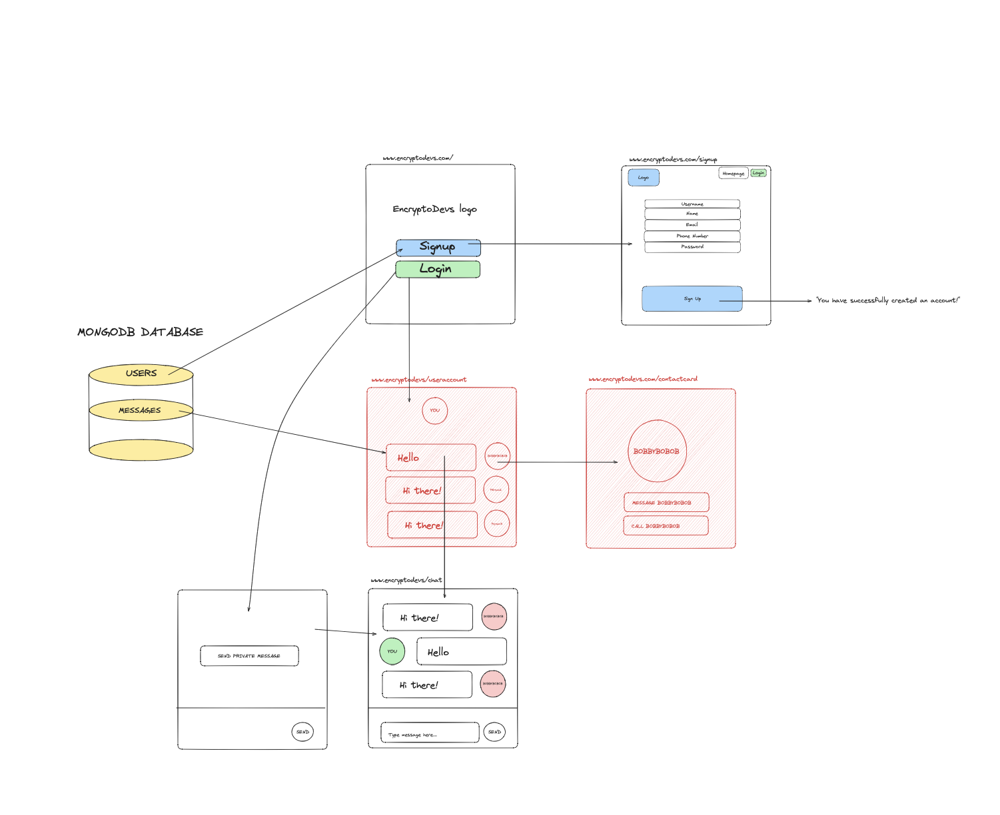
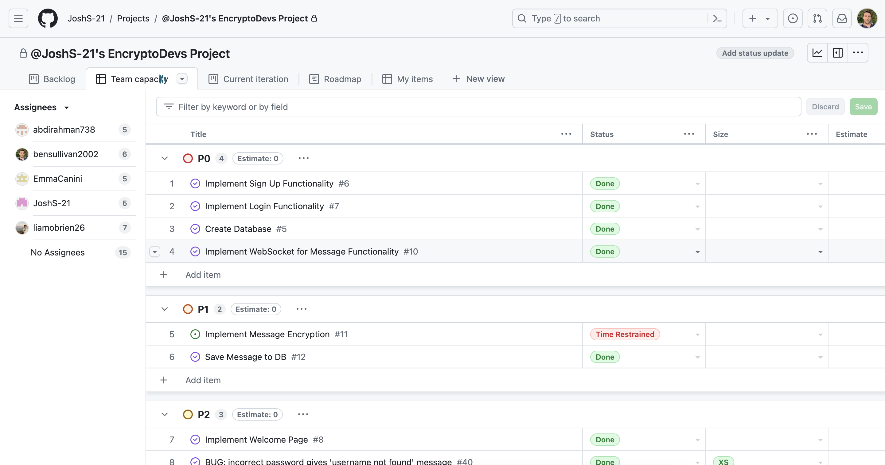
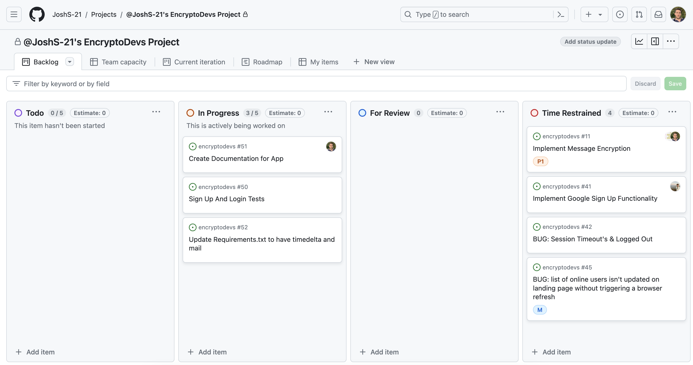

# EncryptoDevs Final Project

## Private Messaging Web App

### Getting Started

1. Clone the GitHub repository from <a href="https://github.com/JoshS-21/encryptodevs.git"> here</a>.

2. Ensure you have <a href="https://www.python.org">Python</a> and <a href="https://nodejs.org/en">Node.js</a> installed
   on your machine.

3. Ensure you have <a href="https://www.mongodb.com/docs/manual/administration/install-community/DB">MongoDB</a> and <a 
   href="https://www.mongodb.com/docs/compass/current/install/">Compass</a> installed on your machine. 

4. Open the project in your preferred IDE.

5. Open a terminal and navigate to the 'api' directory and create a new file called .env (with no file extension). Add 
   the following contents to the file, then save:

    `***CHECK WHAT CODE NEEDS TO GO HERE***`  
(Include the quotation marks.)
***THIS FILE MUST NOT BE PUSHED TO A REMOTE REPOSITORY! BE SURE TO ADD IT TO YOUR '.gitignore' FILE!***

6. Whilst in the 'api' directory, run 

    `python3 -m pip install -r requirements.txt`  
to install the dependencies for the Flask backend app. 

7. While still in the 'api' directory, run

    `python3 mongodb_initialization.py`  
to initialise the database. Use Compass to verify the creation of the 'encryptodevs' database and a 'users' collection 
containing one test user called 'abdio'.

8. 'cd' into the 'frontend/my-react-app' directory. Run

    `npm install`  
to install the dependencies for the React frontend app.

9. Whilst still in the 'frontend/my-react-app' directory, run

    `npm start`  
and click <a href="http://localhost:3000">http://localhost:3000</a> to launch the browser. The page will reload when you
make changes.
You may also see any lint errors in the console.

10. Open a new terminal leaving the first open and cd to the 'api' directory. Run

    `python3 app.py`  
to start the backend server.

You can now test the app running on your local server. You can use Compass to view items (users and messages) in the
MongoDB database.

***

### Initial MVP

Our aim as a group was to create a secure message app, modelled loosely on WhatsApp or Signal.

#### Functionality:
> - Send secure text-based messages
> - Users will be able to sign up and sign in
> - Find and add friends/contacts
> - Messaging notification (in-app)

#### Database collections: Users, Messages
#### DB Server: MongoDB

#### Non MVP ‘Nice-to-Haves’:
> - Call functionality
> - Group chat functionality
> - Sending audio/image messages
> - Video calling
> - Click profile picture in chat to view contact card  

### App UI Plan

 
 

***

### WebSocket vs HTTP

In the interest of time, we decided that using WebSockets would be preferable to normal HTTP requests for this project. 
They enable real-time, bidirectional communication between the client and server- 
**i.e. They keep a connection open as people are sending messages back and forth, without reloading or sending new 
requests everytime someone presses 'send'.**
Although there are likely other better or more advanced technologies than WebSockets that would be used in industry, 
this functionality of keeping an open connection is crucial for instant messaging.

 

#### Key advantages:
> - Real-Time Communication: WebSockets allow for instantaneous data transfer, making messages appear in real-time
> - Bidirectional: WebSockets support two-way communication, enabling both the client and server to send and receive 
    messages at any time
> - Efficient: WebSockets maintain a single open connection, instead of relying on multiple HTTP connections
> - Low Latency: WebSockets allows faster data transfer compared to the request-response model of HTTP, ensuring faster 
    message delivery
> - Scalability: WebSockets can handle a large number of simultaneous connections, making them suitable for applications
    with many users interacting in real-time

***

### Sequence Diagram

Although we had to abandon implementation of end-to-end encryption due to time constraints, the sequence
diagram includes this functionality.

***

### Current Features
Our web app has the following features currently implemented:

- #### New user sign-up
  > - Password validation rules
  > - Username, email, and phone number 'uniqueness' check (against existing users in the database)
  > - Password encryption prior to database storage
    
- #### Existing user login
  > - Graceful handling of incorrect user detail entry
  > - User authentication and authorisation

- #### User logout
- #### Forgotten password
    > - password reset functionality

- #### Landing Page
  > - All-users directory
  > - User login status indicator

- #### Private Messaging
  > - User-user private chat page with message logging on-screen
  > - Message storage to the database (unencrypted)
  > - 'Received message' alert for recipients not in the chat screen

***

### Tech Stack

> - BackEnd - Python (Flask)
> - FrontEnd - JavaScript (React) 
> - Database - MongoDB (with Compass for UI)

***

### Future Features
Due to the strict time limitations associated with the project, we tried to ensure we kept our MVP to a very basic set
of features. However, we also identified some of the features we would wish to implement next, given more time. This
is not an exhaustive list, and most readers will be aware of the wide range of possibilities with such an app, such as
sharing of multimedia content, voice- and video-calling, use of emojis, group chats, mobile application 
(iOS and Android) variants, use of local device contacts, chat history back-up and restoration, multi-device access 
(such as mobile phone vs. desktop app vs. web app) ability to invite users to sign up to the app, and more.  

The following details features we feel would represent the 'next steps', rather than an exhaustive list of all 
possibilities, such as detailed above.  

- #### Use of XMPP (the Extensible Messaging and Presence Protocol)
  > - an application-layer protocol which can be configured to sit on top of the lower-level WebSocket (transport-layer 
      sort of!) protocol we have employed

- #### End-to-End Encryption (E2EE)
  > - Initially in our MVP but removed due to time constraints
  > - A 'must' in today's security-conscious world
  > - Preferably using the Signal Protocol

- #### Message queueing and chat history retrieval
  > - Ability to send a message to a user who is not logged in, and for the recipient to retrieve the message at next 
      login
  > - Ability to reload chat history for each user-user pair on starting a 'new' chat
  > - Various possible options, including (but not limited to) an in-memory cache and queue service such as 
      Redis/Redis Stream (on the back end)

- #### Local device 'contacts' access/integration

***

### Tools and Workflow Collaboration

> - GitHub 'Projects' was used as the communal organiser (Kanban) to keep track of tasks and workflow during the project

 
> - Morning stand-ups as a group to briefly discuss work for the day before splitting into smaller groups
> - After-lunch meetings on an ad-hoc basis to discuss any progress or blockers
> - Daily retros from 4pm as a group, including code review, to merge pull requests and resolve any conflicts between 
    versions, before pushing all completed changes to the main branch

